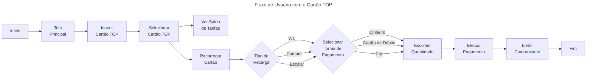
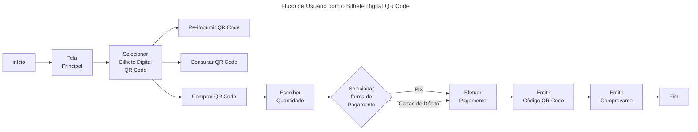
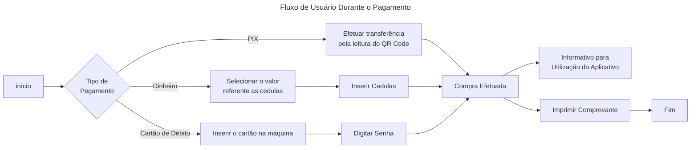

<h1> Projeto UC Dual AutoPass </h1>

<h2> Integrantes do Grupo: </h2>
<h3> Arthur Batista Furlan, RA: 820140000 </h3>

# Sumary

* [Sumary](#sumary)
* [About](#about-project)
* [Technology Used](#technology-used)
* [1 - Application Characteristics and Requirements](#1---application-characteristics-and-requirements)
  * [Functional Requirements](#functional-requirements)
  * [User Flow](#user-flow)
* [2 - Personas](#2---personas)
* [3 - Scenery](#3---scenery)

# About Project

O projeto tem como pauta o `re-design` e `desenvolvimento` de novos módulos para uma aplicação usada em `ATMs`
de recarga de bilhete de transporte público.

A empresa em questão é a `AutoPass` que oferece os serviços dos bilhetes `TOP`, é uma empresa voltada a descobrir novas tecnologias e implanta-las nas suas regras de negócios para trazer aquilo de melhor para os seus clientes.

O foco do projeto é aprimorar a `usabilidade` e `UX (experiência do usuário)` trazendo uma aplicação amigável e intuitiva, além de incentivar todos a baixarem o APP, que é o foco atual da empresa.

A identidade visual da empresa será mantida, mas vai ser trazido um novo design para a aplicação, moderno e intuitivo, que irá agradar o público destinado.

# Technology Used

* [HTML5](https://html.spec.whatwg.org/)
* [JavaScript](https://developer.mozilla.org/pt-BR/docs/Web/JavaScript)
* [CSS3](https://developer.mozilla.org/en-US/docs/Web/CSS)
* [NodeJs](https://nodejs.org/docs/latest-v20.x/api/)
* [NPM](https://docs.npmjs.com/)

# 1 - Application Characteristics and Requirements

A `AutoPass` pode ser considerada a maior empresa privada que traz soluções para a área de bilhetagem eletrônica no Brasil, realizando e gerindo mais de 4,5 milhões de transações diárias. Com 12 anos no mercado, ela traz como diferencial as inúmeras ferramentas tecnológicas capazes de se adaptar a qualquer tipo de plataforma, trazendo inteligência, flexibilidade e rapidez em seus serviços.

No caso da aplicação em estudo, os `ATMs`, é necessário uma nova cara para os mesmo, pois ainda é um serviço muito utilizado na grande São Paulo e como é um produto caro de implantar, seu funcionamento deve ser otimizado e ajustado para atender todo o público, a seguir os serviços oferecidos diretamente nos `ATMs`:

Recarga/Status do `Cartão TOP`: o cartão TOP é similar ao bilhete único, com ele é possível embarcar em nos transportes públicos que abrangem as `estações da CPTM e Metrô` além do transporte `intermunicipais de ônibus da EMTU`.

Emissão de `Bilhete Digital QR Code`: é um bilhete digital emitido em um papel com QR Code, destinado ao embarque nas mais de 180 `estações da CPTM e Metrô` de São Paulo.

Recarga/Status do `Bilhete Único`: o bilhete único é muito utilizado, ele é gerido pela `SPTrans, CPTM e Metrô`, oferecendo o armazenamento de crédito para pagamento de tarifas nos transportes públicos na cidade de São Paulo.

## Functional Requirements

* [x] Recarregar Cartão TOP em Dinheiro

* [x] Recarregar Cartão TOP via Cartão de Débito

* [ ] Recarregar Cartão TOP via PIX

* [x] Consultar o saldo do Cartão TOP

* [x] Vender Bilhete Digital QR Code via Cartão de Débito

* [ ] Vender Bilhete Digital QR Code via PIX

* [x] Verificar/Re-imprimir Bilhete Digital QR Code

* [x] Recarregar Bilhete Único em Dinheiro

* [x] Recarregar Bilhete Único via Cartão de Débito

* [ ] Recarregar Bilhete Único via PIX

* [x] Consultar o saldo do Bilhete Único

## User Flow

# 2 - Personas

<iframe src="https://app.milanote.com/1PY3FG1lEWvXbZ?p=bnJFryhCiY4" width="800" height="500" frameborder="0"></iframe>

* [LINK PARA PERSONAS COMPLETO](https://app.milanote.com/1PY3FG1lEWvXbZ?p=bnJFryhCiY4)

# 3 - Scenery
